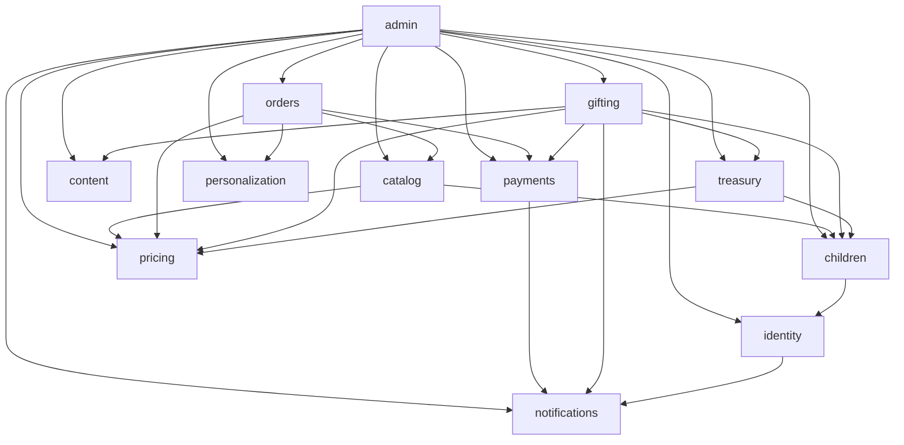

# رجیستری ماژول‌ها

> **قبل از ساخت هر فیچر جدید، این فایل را بخوانید.**
> بیشتر دوباره‌کاری‌ها از آنجا می‌آید که کسی نمی‌داند قابلیت مشابه قبلاً ساخته شده است.

وضعیت‌ها: ✅ کامل — 🚧 در حال ساخت — 📋 برنامه‌ریزی‌شده — ⛔ خارج از دامنه فعلی

| ماژول | وضعیت | مسئولیت | مستند |
| --- | --- | --- | --- |
| `identity` | ✅ | کاربر، ورود با کد یک‌بارمصرف، سشن، نقش‌ها، احراز هویت کامل | [`../03-modules/identity.md`](../03-modules/identity.md) |
| `children` | ✅ | پروفایل کودک، رابطه سرپرستی، تایم‌لاین زندگی | [`../03-modules/children.md`](../03-modules/children.md) |
| `treasury` | ✅ | گنجینه، دفتر کل طلا، پوشش طلا، اهداف، مایل‌استون‌ها | [`../03-modules/treasury.md`](../03-modules/treasury.md) |
| `gifting` | ✅ | لینک هدیه، مشارکت، پیام یادگاری، کارت هدیه فیزیکی | [`../03-modules/gifting.md`](../03-modules/gifting.md) |
| `catalog` | ✅ | محصول، گونه، دسته‌بندی، مناسبت، جست‌وجو | [`../03-modules/catalog.md`](../03-modules/catalog.md) |
| `pricing` | ✅ | قیمت مرجع طلا و موتور قیمت‌گذاری شفاف محصول | [`../03-modules/pricing.md`](../03-modules/pricing.md) |
| `orders` | ✅ | سبد خرید، ثبت سفارش، قفل قیمت، ماشین حالت سفارش | [`../03-modules/orders.md`](../03-modules/orders.md) |
| `payments` | ✅ | پورت پرداخت، کارت‌به‌کارت، رسید، صف تایید | [`../03-modules/payments.md`](../03-modules/payments.md) |
| `personalization` | ✅ | شخصی‌سازی محصول و پیش‌نمایش | [`../03-modules/personalization.md`](../03-modules/personalization.md) |
| `notifications` | ✅ | اعلان درون‌سیستمی و پیامک | [`../03-modules/notifications.md`](../03-modules/notifications.md) |
| `admin` | ✅ | داشبورد و ابزارهای مدیریت | [`../03-modules/admin.md`](../03-modules/admin.md) |
| `content` | ✅ | محتوای ایستا، پرسش‌های متداول، تنظیمات سایت | [`../03-modules/content.md`](../03-modules/content.md) |

## نقشه وابستگی ماژول‌ها

خط‌ها از طریق `index.ts` مقصد مجازند. استثنا: کامپوننت کلاینت و لایه `domain` از مسیرهای
`ui/`، `actions/` و `domain/` import می‌کنند تا `server-only` وارد باندل مرورگر نشود.

**قانون:** این گراف نباید دور (cycle) داشته باشد. اگر برای فیچری نیاز به وابستگی معکوس پیدا کردید،
آن نشانه این است که منطق در ماژول اشتباهی نشسته — نه اینکه باید وابستگی معکوس اضافه کنید.

## قابلیت‌های مشترکی که نباید دوباره ساخته شوند

اگر به یکی از این‌ها نیاز دارید، **از موجود استفاده کنید**:

| نیاز | کجاست |
| --- | --- |
| ادغام کلاس‌های Tailwind | `shared/lib/cn.ts` |
| محاسبه و فرمت پول | `shared/lib/money.ts` |
| محاسبه و فرمت وزن طلا | `shared/lib/gold.ts` |
| تبدیل و فرمت تاریخ جلالی | `shared/lib/jalali.ts` |
| ورودی تاریخ و ساعت شمسی | `shared/ui/jalali-date-input.tsx` |
| انتخاب با تایپ و فیلتر فهرست | `shared/ui/search-select.tsx` |
| تبدیل ارقام فارسی/انگلیسی | `shared/lib/persian.ts` |
| اعتبارسنجی موبایل و کد ملی | `shared/lib/validators.ts` |
| ساخت Server Action امن | `server/actions/action-kit.ts` |
| خواندن کاربر جاری | `server/auth/session.ts` |
| بررسی نقش و مجوز | `server/auth/rbac.ts` |
| ذخیره و خواندن فایل آپلودی | `server/storage/file-storage.ts` |
| لاگ ساخت‌یافته | `server/logger.ts` |
| اسلایدر افقی با نقطه | `shared/ui/snap-slide-track.tsx` |
| استان و شهر ایران | `shared/data/iran-places.ts` |
| فهرست بانک‌های ایران | `shared/data/iran-banks.ts` |

## چک‌لیست افزودن ماژول جدید

1. اطمینان از اینکه واقعاً ماژول جدید لازم است و در ماژول موجود جا نمی‌شود.
2. اضافه‌کردن ردیف به جدول بالا و به‌روزرسانی نمودار وابستگی.
3. ساخت `docs/03-modules/<name>.md` از روی [`../03-modules/_template.md`](../03-modules/_template.md).
4. ساخت پوشه با ساختار استاندارد و یک `index.ts` که فقط API عمومی را صادر می‌کند.
5. اجرای `npm run check:arch` برای اطمینان از سلامت ساختار.
