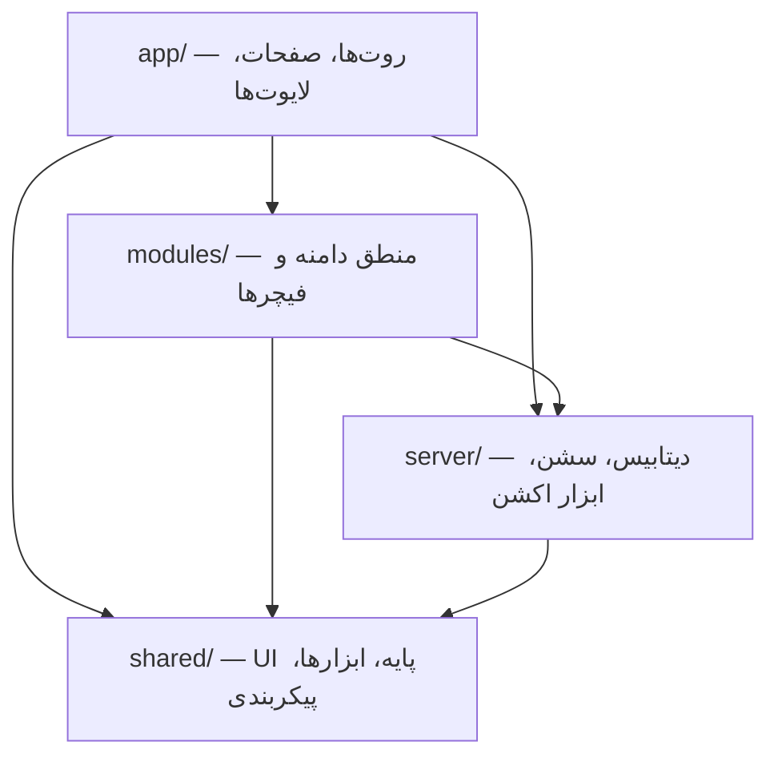
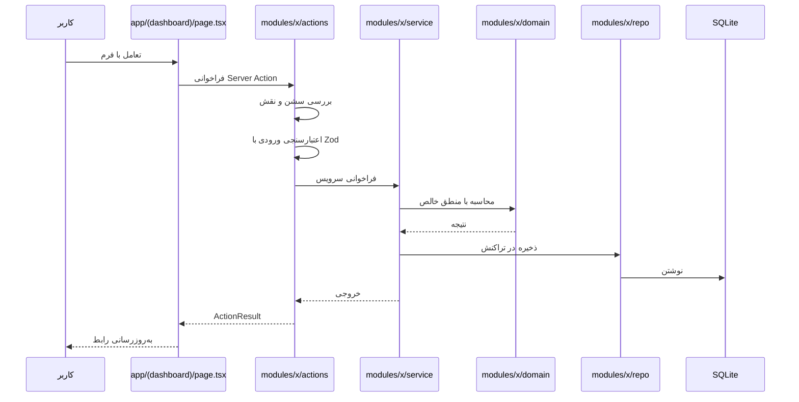

# معماری پروژه

## اصل حاکم

> هر تکه کد دقیقاً **یک** جای درست دارد. اگر مطمئن نیستید کجا بگذاریدش، یعنی هنوز مسئله را نفهمیده‌اید.

معماری ما لایه‌ای و ماژولار است. مرزها **با ابزار قفل شده‌اند** (ESLint)، نه فقط با توافق شفاهی.
نقض مرز = خطای لینت = بیلد شکست می‌خورد.

## چهار لایه



قوانین وابستگی، دقیقاً:

| از | می‌تواند import کند از |
| --- | --- |
| `app/` | `modules/*` (پیش‌فرض `index.ts`)، `server/`، `shared/` |
| `modules/x` | `server/`، `shared/`، و `modules/y` **از طریق `index.ts`** |
| `server/` | `shared/` |
| `shared/` | فقط `shared/` |

هر جهت دیگری ممنوع است. مشخصاً:

- `shared/` **هرگز** نباید از `modules/` یا `server/` چیزی بخواهد.
- `server/` **هرگز** نباید از `modules/` چیزی بخواهد.
- `modules/x/domain/` **هرگز** نباید از دیتابیس یا React چیزی بخواهد.

## چرا `app/` نازک است

پوشه `app/` فقط مسئول **مسیریابی و چیدمان** است. هیچ منطق کسب‌وکاری آنجا نوشته نمی‌شود.
یک `page.tsx` سالم چیزی شبیه این است: داده را از سرویس ماژول بگیر، به کامپوننت ماژول بده، تمام.

اگر در `page.tsx` محاسبه قیمت یا کوئری دیتابیس دیدید، آن یک باگ معماری است.

## آناتومی یک ماژول

هر ماژول در `src/modules/<name>/` دقیقاً همین ساختار را دارد:

```
modules/treasury/
├── index.ts          ← تنها دروازه عمومی ماژول
├── domain/           ← منطق خالص؛ بدون دیتابیس، بدون React، ۱۰۰٪ تست‌پذیر
│   ├── treasure.ts
│   └── treasure.test.ts
├── repo/             ← تنها جایی که به دیتابیس دست می‌زند
│   └── treasure.repo.ts
├── service/          ← ارکستراسیون: اعتبارسنجی + دامنه + repo + رویداد
│   └── treasure.service.ts
├── actions/          ← Server Actions (مرز ورودی از UI)
│   └── treasure.actions.ts
├── schema/           ← اسکیماهای Zod ورودی
│   └── treasure.schema.ts
└── ui/               ← کامپوننت‌های مخصوص همین ماژول
    └── treasure-card.tsx
```

قانون: **صفحات Server Component از `index.ts` import می‌کنند.** مسیر داخلی فقط برای
کامپوننت کلاینت و لایه `domain` مجاز است (تا `server-only` وارد باندل مرورگر نشود).

```ts
// ✅ صفحات سرور — از دروازه عمومی
import { calculateProgress } from "@/modules/treasury";

// ✅ فایل "use client" یا domain — مسیر داخلی امن
import { matchesAgeRange } from "@/modules/children/domain/child-age";

// ❌ کامپوننت کلاینت حق ندارد از index.ts ماژول دیگر import کند
import { logout } from "@/modules/identity";
```

دلیل: وقتی همه فقط از `index.ts` استفاده کنند، بازنویسی داخل ماژول هیچ‌جای دیگری را نمی‌شکند.

### استثنای اجباری برای کامپوننت کلاینت

`index.ts` سرویس‌های `server-only` را هم صادر می‌کند. اگر فایل `"use client"` از همان
`index.ts` import کند، Next.js کل barrel را وارد باندل مرورگر می‌کند و بیلد می‌شکند.

- صفحات Server Component از `index.ts` import می‌کنند.
- فایل‌های `"use client"` و لایه `domain/` فقط از `ui/`، `actions/` یا `domain/` ماژول دیگر import می‌کنند.
- ESLint این استثنا را قفل کرده است.

## نقش هر لایه داخل ماژول

| لایه | مسئولیت | چه چیزی ممنوع است |
| --- | --- | --- |
| `domain/` | قوانین کسب‌وکار، محاسبات، ماشین‌های حالت | import از `server/db`، از React، از Next |
| `repo/` | خواندن و نوشتن دیتابیس | منطق کسب‌وکار، اعتبارسنجی ورودی |
| `service/` | چسباندن اجزا؛ تراکنش؛ فراخوانی سرویس ماژول‌های دیگر | رندر کردن، دسترسی مستقیم به `cookies()` |
| `actions/` | مرز ورودی: احراز هویت، مجوز، اعتبارسنجی Zod، فراخوانی سرویس | منطق کسب‌وکار |
| `ui/` | نمایش | کوئری مستقیم دیتابیس |

## چرا `domain/` باید خالص باشد

منطق مالی این پروژه (محاسبه قیمت، تبدیل ریال به میلی‌گرم طلا، پیشرفت گنجینه) حساس‌ترین بخش آن است.
وقتی این منطق در توابع خالص باشد، می‌شود با ده‌ها تست واحد سریع پوششش داد. اگر با دیتابیس درهم برود،
عملاً غیرقابل تست می‌شود و باگ‌های مالی به production می‌رسند.

## گروه‌های مسیر در `app/`

```
app/
├── (site)/          صفحات عمومی: خانه، محصولات، مناسبت‌ها، درباره ما
├── (auth)/          ورود و ثبت‌نام با کد یک‌بارمصرف
├── (dashboard)/     داشبورد والد: کودکان، گنجینه‌ها، سفارش‌ها، پروفایل
├── (gift)/          صفحه عمومی هدیه — بدون نیاز به ورود
├── admin/           پنل مدیریت با کنترل دسترسی نقش‌محور
└── api/             فقط جایی که Route Handler واقعاً لازم است (وبهوک، سرو فایل، QR)
```

**پیش‌فرض ما Server Action است، نه Route Handler.** Route Handler فقط وقتی که مصرف‌کننده بیرونی
یا پاسخ غیر‌HTML داریم.

## گردش یک درخواست نوعی



## مدیریت خطا

هیچ اکشنی نباید استثنای خام به UI بدهد. همه اکشن‌ها یک نوع خروجی مشترک دارند:

```ts
type ActionResult<T> =
  | { ok: true; data: T }
  | { ok: false; error: string; fieldErrors?: Record<string, string[]> };
```

پیام خطا **همیشه فارسی و قابل‌فهم برای کاربر نهایی** است. جزئیات فنی فقط در لاگ سرور می‌رود.

## مستندات مرتبط

- قوانین کدنویسی: [`conventions.md`](conventions.md)
- ساختار پوشه‌ها با جزئیات: [`folder-structure.md`](folder-structure.md)
- فهرست ماژول‌ها: [`module-registry.md`](module-registry.md)
