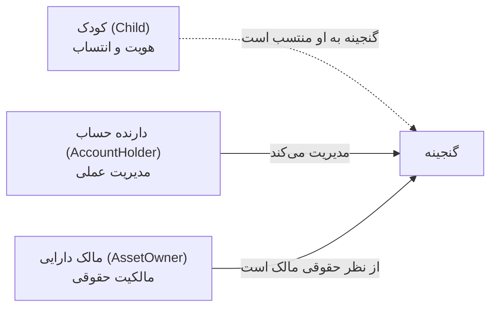

# قوانین دامنه

> این قوانین **غیرقابل مذاکره** هستند. تغییر هرکدام نیازمند ADR جدید است.
> نقض این قوانین باگ‌های مالی تولید می‌کند که ماه‌ها بعد کشف می‌شوند.

## ۱. هیچ عدد اعشاری در محاسبات مالی

اعداد اعشاری IEEE-754 برای پول ساخته نشده‌اند. `0.1 + 0.2 !== 0.3` و در یک پلتفرم طلا این یعنی
اختلاف موجودی.

| مفهوم | واحد ذخیره | تایپ | نمایش به کاربر |
| --- | --- | --- | --- |
| پول | ریال | `integer` | تومان (تقسیم بر ۱۰) |
| وزن طلا | میلی‌گرم | `integer` | گرم (تقسیم بر ۱۰۰۰) |
| درصد | صدم درصد (basis point) | `integer` | درصد |

```ts
// ❌ ممنوع
const total = weightGram * pricePerGram * 1.09;

// ✅ درست
const goldValueRial = mulDiv(weightMg, pricePerGramRial, MG_PER_GRAM);
const vatRial = percentOf(goldValueRial, vatBasisPoints);
```

تبدیل واحد **فقط در لایه نمایش** انجام می‌شود، هرگز در دامنه یا دیتابیس.

## ۲. گرد کردن یک قانون مشخص دارد

هر جا تقسیم لازم است، از `mulDiv` استفاده کنید که با نیم‌به‌بالا (half-up) گرد می‌کند.
گرد کردن **فقط یک بار و در انتهای زنجیره محاسبه** انجام می‌شود، نه در هر مرحله.

در سفارش چند قلمی، جمع کل از جمع مبالغ گردشده اقلام به‌دست می‌آید (نه گرد کردن مجدد جمع)،
تا مبلغی که کاربر می‌بیند دقیقاً با جمع ریز اقلام بخواند.

## ۳. دفتر کل طلا فقط append-only است

هیچ‌جا ستونی به نام «موجودی گنجینه» وجود ندارد که آپدیت شود.

موجودی همیشه از جمع قلم‌های دفتر کل محاسبه می‌شود:

```
موجودی = مجموع ورودی‌ها − مجموع خروجی‌ها
```

- هیچ قلم دفتر کلی **حذف یا ویرایش نمی‌شود**.
- اشتباه با یک قلم اصلاحی جدید (`source = 'correction'`) جبران می‌شود.
- هر قلم باید `reference_type` و `reference_id` داشته باشد تا منشأ آن قابل ردیابی باشد.

دلیل: حسابرسی‌پذیری. وقتی کاربری بپرسد «چرا موجودی من این‌قدر است؟» باید بتوانیم دقیقاً
تک‌تک ورودی‌ها را نشان دهیم.

پوشش طلا (`gold_cover_entries`) هم append-only است و جدا از دفتر کل کودک. تعهد =
جمع `pure_mg` دفتر کل؛ پوشش = جمع خریدهای ثبت‌شدهٔ فروشگاه؛ باقیمانده = حداکثر(۰، تعهد − پوشش).
این بازخرید به کاربر نیست.

## ۴. جمع‌زدن طلاهای با عیار متفاوت

طلای ۱۸ عیار و ۲۴ عیار مستقیماً جمع‌پذیر نیستند. برای هر قلم، معادل طلای خالص هم ذخیره می‌شود:

```
pureMg = amountMg × karat ÷ 24
```

- نمایش موجودی به کاربر: بر مبنای عیار ۱۸ (استاندارد بازار ایران).
- جمع داخلی و گزارش‌ها: بر مبنای `pureMg`.

## ۵. سه مفهوم مالکیت هرگز یکی نیستند



- «گنجینه آراد» یعنی این گنجینه **به نام آراد** است، نه اینکه آراد مالک قانونی آن است.
- در MVP، `asset_owner_user_id` همیشه دارنده حساب بزرگسال است.
- این سه فیلد در دیتابیس **جدا** هستند تا وقتی مدل حقوقی روشن شد، بدون مهاجرت دردناک قابل تغییر باشد.

## ۶. هدیه‌دهنده مالک نیست

خاله که یک میلیون تومان پرداخت می‌کند:

- در `contributions` به‌عنوان هدیه‌دهنده ثبت می‌شود (برای نمایش، تشکر و پیام یادگاری).
- **هیچ ادعای مالکیتی روی طلا ندارد.**
- طلای حاصل به‌عنوان یک قلم در دفتر کل گنجینه ثبت می‌شود با `reference_type = 'contribution'`.

مشارکت و قلم دفتر کل دو رکورد جدا هستند و نباید ادغام شوند.

## ۷. طلا فقط پس از تایید قطعی پرداخت ثبت می‌شود

هیچ میلی‌گرمی وارد دفتر کل نمی‌شود مگر پرداخت مربوطه وضعیت `confirmed` داشته باشد.
در کارت‌به‌کارت، این یعنی **پس از تایید دستی ادمین**.

قیمت تبدیل ریال به طلا، **قیمت لحظه تایید پرداخت** است، نه لحظه ثبت مشارکت.
این تصمیم عمدی است: تا پول واقعاً تایید نشده، ریسک نوسان قیمت را نمی‌پذیریم.
این نکته باید در رابط کاربری به هدیه‌دهنده شفاف گفته شود.

## ۸. قیمت هنگام ثبت سفارش قفل می‌شود

هنگام ثبت سفارش، تمام اجزای قیمت در `order_items` ذخیره می‌شوند:

وزن، عیار، قیمت هر گرم طلا در آن لحظه، ارزش طلای خام، اجرت، سود، حباب، بسته‌بندی، مالیات،
قیمت واحد و جمع ردیف.

سفارش قدیمی **هرگز** با قیمت‌های امروز بازمحاسبه نمی‌شود. صفحه سفارش همان اعدادی را نشان می‌دهد
که مشتری هنگام خرید دیده است.

## ۹. فرمول قیمت‌گذاری

برای زیورآلات:

```
ارزش طلای خام = وزن(mg) × قیمت هر گرم(ریال) × عیار ÷ (۱۰۰۰ × ۲۴)
اجرت           = ارزش طلای خام × درصد اجرت
سود            = (ارزش طلای خام + اجرت) × درصد سود
مالیات         = (اجرت + سود) × نرخ مالیات
قیمت واحد      = ارزش طلای خام + اجرت + سود + مالیات + شخصی‌سازی + بسته‌بندی
```

برای محصولات سرمایه‌ای (سکه و شمش):

```
ارزش طلای خام = وزن(mg) × قیمت هر گرم(ریال) × عیار ÷ (۱۰۰۰ × ۲۴)
قیمت واحد     = ارزش طلای خام + حباب + بسته‌بندی
```

> نکته مالیاتی: طبق رویه بازار، مالیات بر ارزش افزوده روی اجرت و سود اعمال می‌شود نه روی ارزش
> طلای خام. نرخ در تنظیمات قابل تغییر است تا با تغییر قانون نیازی به تغییر کد نباشد.

## ۱۰. زمان‌ها

- همه زمان‌ها به‌صورت **epoch میلی‌ثانیه UTC** به‌صورت `integer` ذخیره می‌شوند.
- تبدیل به تاریخ شمسی **فقط در لایه نمایش**.
- هیچ‌جا رشته تاریخ شمسی در دیتابیس ذخیره نمی‌شود.

## ۱۱. شناسه‌ها

- کلید اصلی همه جدول‌ها: رشته ۲۱ کاراکتری تولیدشده با `nanoid`.
- دلیل: قابل تولید در سطح اپلیکیشن (بدون رفت‌وبرگشت به دیتابیس)، غیرقابل حدس، و امن برای نمایش در URL.
- شماره‌های قابل‌نمایش به کاربر (شماره سفارش، شماره پرداخت) جدا و خواناتر هستند: `HM-1404-000123`.

## ۱۲. حذف نرم

رکوردهای مالی و حسابرسی‌پذیر **هرگز فیزیکی حذف نمی‌شوند**. به‌جای آن وضعیت تغییر می‌کند
یا `archived_at` پر می‌شود.

## ۱۳. قیمت مرجع طلا

نمایش و فروش از قیمت زنده طلا دات آی‌آر است (هر دو عیار در یک درخواست، کش ۶۰ ثانیه).
مقدار سایت تومان هر گرم است؛ در پارس یک‌بار به ریال تبدیل می‌شود و درصد افزوده از تنظیمات
(`pricing.live_markup_bp`؛ پیش‌فرض ۲٪) با `percentOf` به آن اضافه می‌گردد.
حاشیه روی قیمت دستی ادمین اعمال نمی‌شود. مدیر ارشد درصد را از داشبورد عوض می‌کند.

اگر واکشی یا پارس شکست بخورد، آخرین ردیف دستی `gold_prices` استفاده می‌شود.
اگر آن هم نباشد فروش **متوقف** است. هر تیک زنده در جدول append-only نوشته نمی‌شود.
