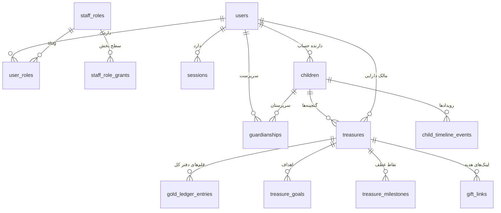
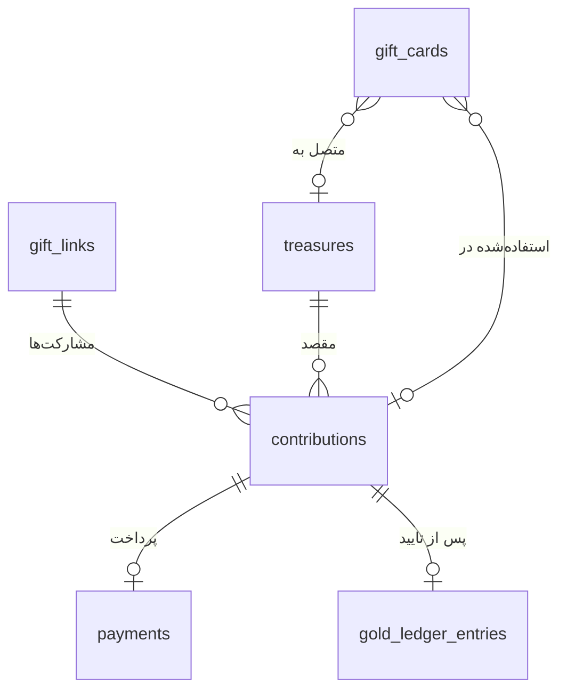
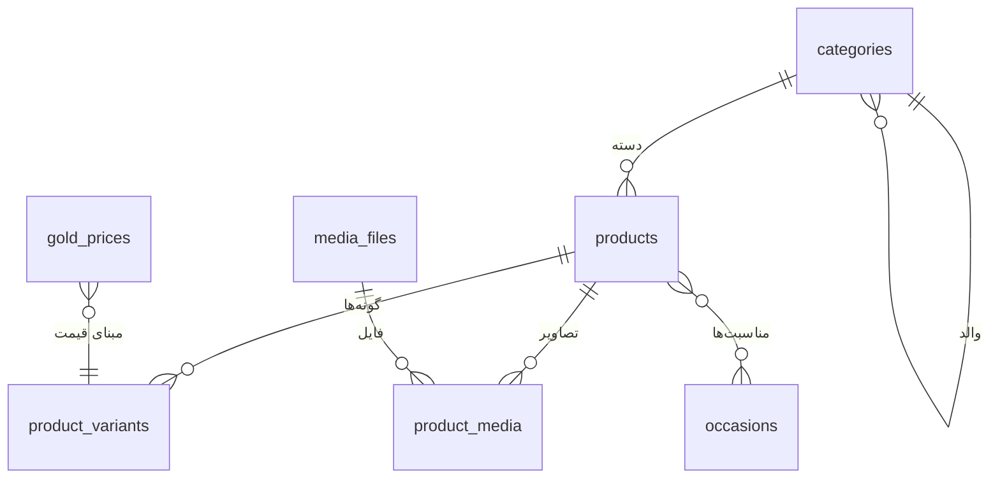
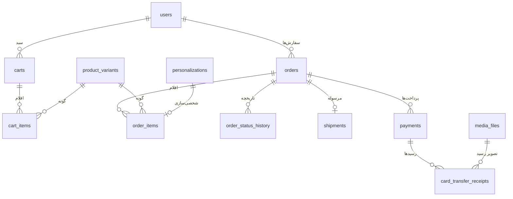
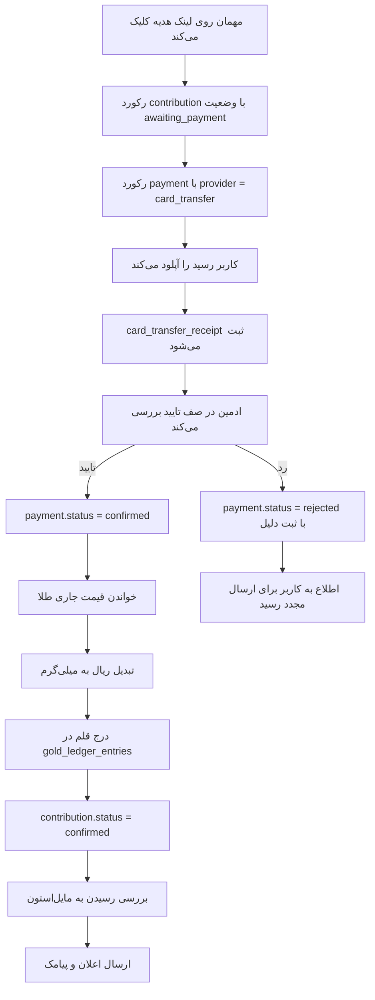

# نمودار موجودیت‌ها

نمودار برای خوانایی به چند بخش تقسیم شده است.

## هسته: کاربر، کودک، گنجینه

## هدیه و مشارکت

## کاتالوگ و قیمت

## سفارش و پرداخت

## مسیر بحرانی: از پول تا طلا

این مهم‌ترین جریان داده پروژه است.

> توجه: مرحله «خواندن قیمت جاری طلا» عمداً **بعد از** تایید ادمین است، نه هنگام ثبت مشارکت.
> دلیل در [`domain-rules.md`](domain-rules.md) بند ۷ آمده است.
