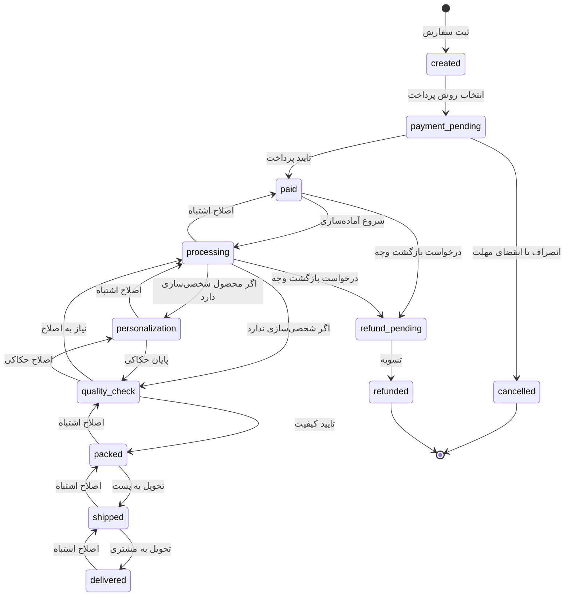
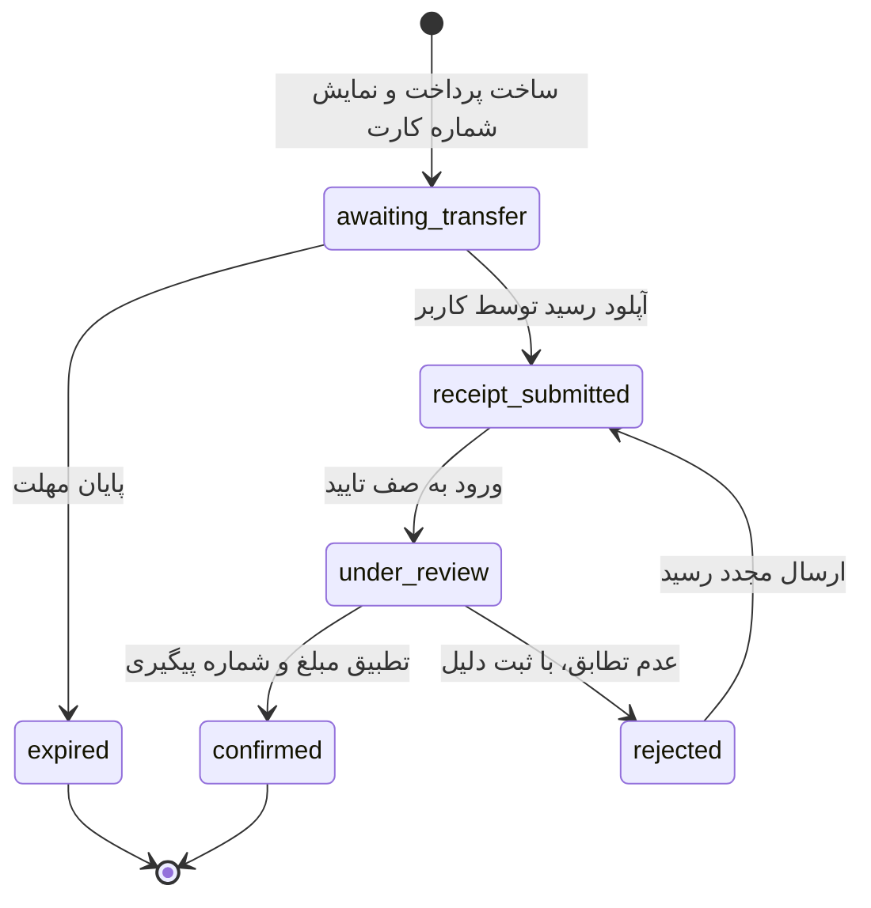
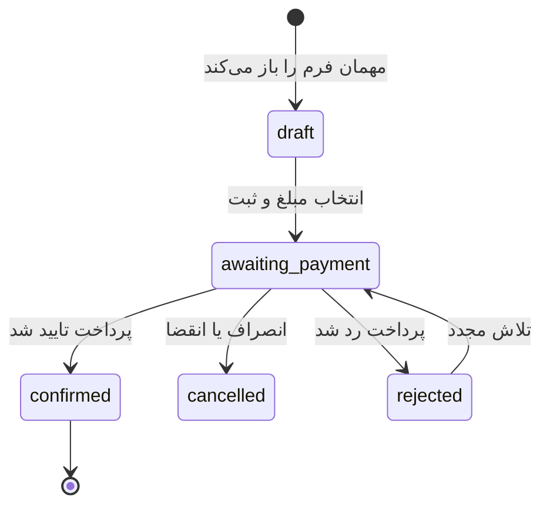
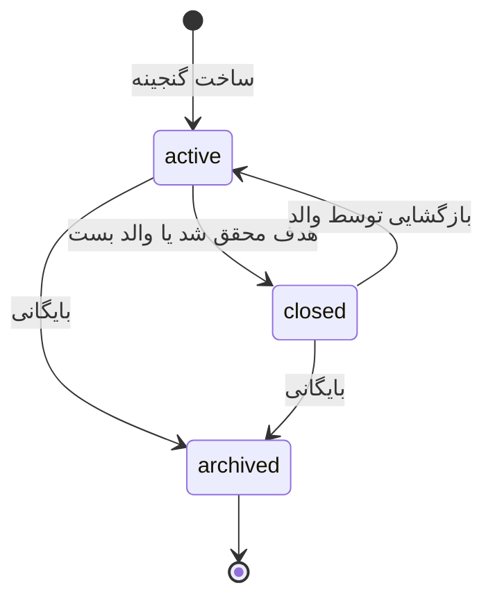
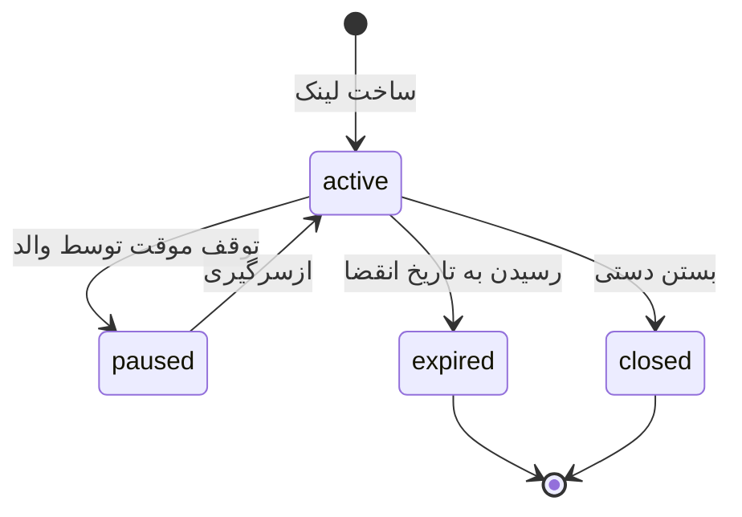
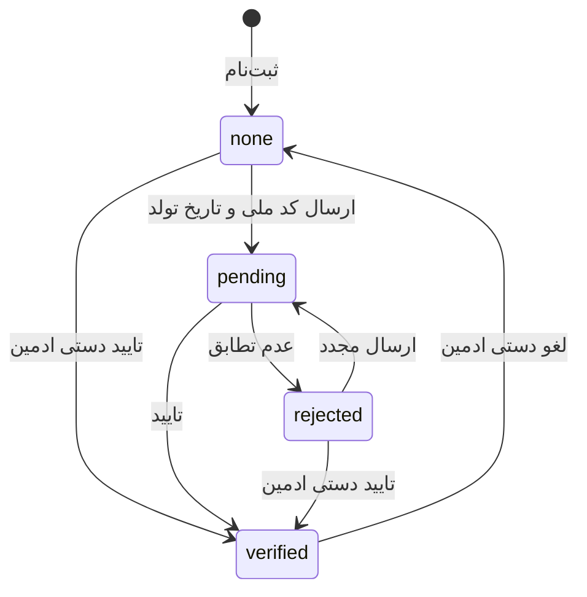

# ماشین‌های حالت

هر گذار وضعیت فقط از طریق تابع مخصوص خودش در `domain/` انجام می‌شود.
**هیچ‌جا `UPDATE ... SET status = ?` مستقیم نوشته نمی‌شود.**
هر گذار در جدول تاریخچه ثبت می‌گردد.

## سفارش

گذارهای مجاز به‌صورت داده در `modules/orders/domain/order-status.ts` تعریف می‌شوند
تا هم قابل تست باشند و هم در UI برای ساخت دکمه‌های مجاز استفاده شوند.

کارمند می‌تواند در مسیر آماده‌سازی تا پس از تحویل یک مرحله برگردد تا کلیک اشتباه
اصلاح شود. بازگشت به `payment_pending` مجاز نیست چون طلا وارد دفتر کل شده است.
از `cancelled` و `refunded` خروجی نیست. تغییر وضعیت در پنل با پاپ‌آپ تایید انجام می‌شود.

## پرداخت کارت‌به‌کارت

قوانین:

- `reference_number` در کل سیستم یکتاست تا یک رسید دو بار پذیرفته نشود.
- مبلغ اعلامی کاربر باید با مبلغ پرداخت بخواند؛ اختلاف در صف تایید هشدار می‌دهد.
- مهلت پیش‌فرض پرداخت ۷۲ ساعت است (قابل تنظیم).
- تایید و رد، هر دو در `audit_logs` ثبت می‌شوند.
- طلا **فقط** در گذار به `confirmed` وارد دفتر کل می‌شود.

## مشارکت در گنجینه

## گنجینه

گنجینه `archived` فقط خواندنی است؛ هیچ قلم جدیدی به دفتر کل آن اضافه نمی‌شود.

## لینک هدیه

لینک غیرفعال همچنان قابل مشاهده است اما دکمه پرداخت ندارد و پیام مناسب نشان می‌دهد.

## احراز هویت کامل

توجه: `none` مانع ورود یا خرید عادی نیست. فقط عملیات مالی خاص به `verified` نیاز دارند.
ادمین می‌تواند از فهرست یا صفحه کاربر احراز هویت را دستی تایید کند (مراجعه حضوری)، درخواست در صف را تایید/رد کند، یا احراز هویت تاییدشده را با پاپ‌آپ به `none` برگرداند. کد ملی پاک نمی‌شود.
